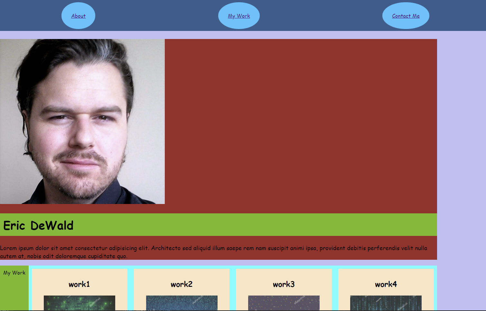

# Assignment-2_Professional Portfolio
=============

first day overview and repo set-up

Html overview-
basic page layout with nav bar at the top with 3 buttons.
They link to related sections on the site.

About me seciton with my profile pic and filler text for update later.

My work section with some styled images and filler text.
They are linked out to a sample project for the code refactor.

contact me is in the footer will add links to socials.

css summery--

added basic colors to help with layout

styled header buttons to grow and change shape on hover

used flex to make fure everything would work when resized

used mida query to change when things are resised

[lin to the website] (https://ericdewald.github.io/Assignment-2_Professional-Portfolio/)